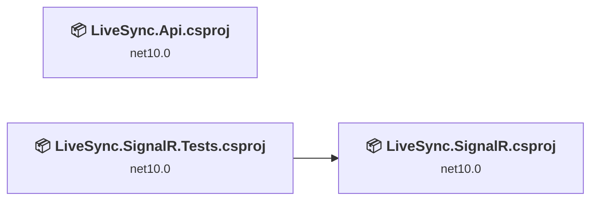
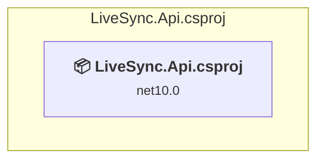
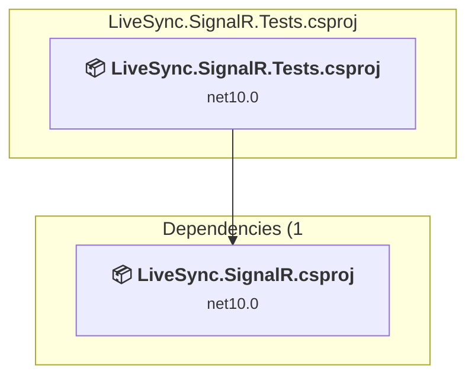
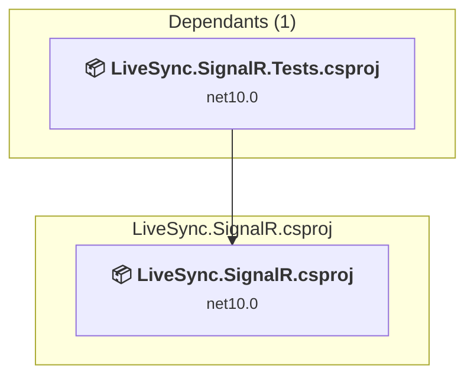

# Projects and dependencies analysis

This document provides a comprehensive overview of the projects and their dependencies in the context of upgrading to .NETCoreApp,Version=v10.0.

## Table of Contents

- [Executive Summary](#executive-Summary)
  - [Highlevel Metrics](#highlevel-metrics)
  - [Projects Compatibility](#projects-compatibility)
  - [Package Compatibility](#package-compatibility)
  - [API Compatibility](#api-compatibility)
  - [Binding Redirect Configuration](#binding-redirect-configuration)
- [Aggregate NuGet packages details](#aggregate-nuget-packages-details)
- [Top API Migration Challenges](#top-api-migration-challenges)
  - [Technologies and Features](#technologies-and-features)
  - [Most Frequent API Issues](#most-frequent-api-issues)
- [Projects Relationship Graph](#projects-relationship-graph)
- [Project Details](#project-details)

  - [LiveSync.Api\LiveSync.Api.csproj](#livesyncapilivesyncapicsproj)
  - [LiveSync.SignalR.Tests\LiveSync.SignalR.Tests.csproj](#livesyncsignalrtestslivesyncsignalrtestscsproj)
  - [LiveSync.SignalR\LiveSync.SignalR.csproj](#livesyncsignalrlivesyncsignalrcsproj)

## Executive Summary

### Highlevel Metrics

| Metric | Count | Status |
| :--- | :---: | :--- |
| Total Projects | 3 | 0 require upgrade |
| Total NuGet Packages | 15 | All compatible |
| Total Code Files | 24 |  |
| Total Code Files with Incidents | 0 |  |
| Total Lines of Code | 3718 |  |
| Total Number of Issues | 0 |  |
| Estimated LOC to modify | 0+ | at least 0.0% of codebase |

### Projects Compatibility

| Project | Target Framework | Difficulty | Package Issues | API Issues | Binding Issues | Est. LOC Impact | Description |
| :--- | :---: | :---: | :---: | :---: | :---: | :---: | :--- |
| [LiveSync.Api\LiveSync.Api.csproj](#livesyncapilivesyncapicsproj) | net10.0 | ✅ None | 0 | 0 | 0 |  | AspNetCore, Sdk Style = True |
| [LiveSync.SignalR.Tests\LiveSync.SignalR.Tests.csproj](#livesyncsignalrtestslivesyncsignalrtestscsproj) | net10.0 | ✅ None | 0 | 0 | 0 |  | DotNetCoreApp, Sdk Style = True |
| [LiveSync.SignalR\LiveSync.SignalR.csproj](#livesyncsignalrlivesyncsignalrcsproj) | net10.0 | ✅ None | 0 | 0 | 0 |  | AspNetCore, Sdk Style = True |

### Package Compatibility

| Status | Count | Percentage |
| :--- | :---: | :---: |
| ✅ Compatible | 15 | 100.0% |
| ⚠️ Incompatible | 0 | 0.0% |
| 🔄 Upgrade Recommended | 0 | 0.0% |
| ***Total NuGet Packages*** | ***15*** | ***100%*** |

### API Compatibility

| Category | Count | Impact |
| :--- | :---: | :--- |
| 🔴 Binary Incompatible | 0 | High - Require code changes |
| 🟡 Source Incompatible | 0 | Medium - Needs re-compilation and potential conflicting API error fixing |
| 🔵 Behavioral change | 0 | Low - Behavioral changes that may require testing at runtime |
| ✅ Compatible | 0 |  |
| ***Total APIs Analyzed*** | ***0*** |  |

## Aggregate NuGet packages details

| Package | Current Version | Suggested Version | Projects | Description |
| :--- | :---: | :---: | :--- | :--- |
| Microsoft.AspNetCore.Authentication.JwtBearer | 8.0.* |  | [LiveSync.Api.csproj](#livesyncapilivesyncapicsproj) [LiveSync.SignalR.csproj](#livesyncsignalrlivesyncsignalrcsproj) | ✅Compatible |
| Microsoft.AspNetCore.Identity.EntityFrameworkCore | 8.0.* |  | [LiveSync.Api.csproj](#livesyncapilivesyncapicsproj) | ✅Compatible |
| Microsoft.AspNetCore.SignalR.StackExchangeRedis | 8.0.* |  | [LiveSync.SignalR.csproj](#livesyncsignalrlivesyncsignalrcsproj) | ✅Compatible |
| Microsoft.EntityFrameworkCore.Tools | 8.0.* |  | [LiveSync.Api.csproj](#livesyncapilivesyncapicsproj) | ✅Compatible |
| Microsoft.Extensions.Configuration | 9.0.0 |  | [LiveSync.SignalR.Tests.csproj](#livesyncsignalrtestslivesyncsignalrtestscsproj) | ✅Compatible |
| Microsoft.Extensions.Configuration.EnvironmentVariables | 9.0.0 |  | [LiveSync.SignalR.Tests.csproj](#livesyncsignalrtestslivesyncsignalrtestscsproj) | ✅Compatible |
| Microsoft.Extensions.Configuration.Json | 9.0.0 |  | [LiveSync.SignalR.Tests.csproj](#livesyncsignalrtestslivesyncsignalrtestscsproj) | ✅Compatible |
| Microsoft.NET.Test.Sdk | 17.11.1 |  | [LiveSync.SignalR.Tests.csproj](#livesyncsignalrtestslivesyncsignalrtestscsproj) | ✅Compatible |
| Npgsql | 8.0.4 |  | [LiveSync.SignalR.Tests.csproj](#livesyncsignalrtestslivesyncsignalrtestscsproj) | ✅Compatible |
| Npgsql.EntityFrameworkCore.PostgreSQL | 8.0.* |  | [LiveSync.Api.csproj](#livesyncapilivesyncapicsproj) | ✅Compatible |
| StackExchange.Redis | 2.8.* |  | [LiveSync.SignalR.csproj](#livesyncsignalrlivesyncsignalrcsproj) | ✅Compatible |
| StackExchange.Redis | 2.8.31 |  | [LiveSync.SignalR.Tests.csproj](#livesyncsignalrtestslivesyncsignalrtestscsproj) | ✅Compatible |
| Swashbuckle.AspNetCore | 6.6.2 |  | [LiveSync.Api.csproj](#livesyncapilivesyncapicsproj) | ✅Compatible |
| xunit | 2.9.2 |  | [LiveSync.SignalR.Tests.csproj](#livesyncsignalrtestslivesyncsignalrtestscsproj) | ✅Compatible |
| xunit.runner.visualstudio | 2.8.2 |  | [LiveSync.SignalR.Tests.csproj](#livesyncsignalrtestslivesyncsignalrtestscsproj) | ✅Compatible |

## Top API Migration Challenges

### Technologies and Features

| Technology | Issues | Percentage | Migration Path |
| :--- | :---: | :---: | :--- |

### Most Frequent API Issues

| API | Count | Percentage | Category |
| :--- | :---: | :---: | :--- |

## Projects Relationship Graph

Legend:
📦 SDK-style project
⚙️ Classic project

## Project Details

### LiveSync.Api\LiveSync.Api.csproj

#### Project Info

- **Current Target Framework:** net10.0✅
- **SDK-style**: True
- **Project Kind:** AspNetCore
- **Dependencies**: 0
- **Dependants**: 0
- **Number of Files**: 18
- **Lines of Code**: 2965
- **Estimated LOC to modify**: 0+ (at least 0.0% of the project)

#### Dependency Graph

Legend:
📦 SDK-style project
⚙️ Classic project

### API Compatibility

| Category | Count | Impact |
| :--- | :---: | :--- |
| 🔴 Binary Incompatible | 0 | High - Require code changes |
| 🟡 Source Incompatible | 0 | Medium - Needs re-compilation and potential conflicting API error fixing |
| 🔵 Behavioral change | 0 | Low - Behavioral changes that may require testing at runtime |
| ✅ Compatible | 0 |  |
| ***Total APIs Analyzed*** | ***0*** |  |

### LiveSync.SignalR.Tests\LiveSync.SignalR.Tests.csproj

#### Project Info

- **Current Target Framework:** net10.0✅
- **SDK-style**: True
- **Project Kind:** DotNetCoreApp
- **Dependencies**: 1
- **Dependants**: 0
- **Number of Files**: 5
- **Lines of Code**: 282
- **Estimated LOC to modify**: 0+ (at least 0.0% of the project)

#### Dependency Graph

Legend:
📦 SDK-style project
⚙️ Classic project

### API Compatibility

| Category | Count | Impact |
| :--- | :---: | :--- |
| 🔴 Binary Incompatible | 0 | High - Require code changes |
| 🟡 Source Incompatible | 0 | Medium - Needs re-compilation and potential conflicting API error fixing |
| 🔵 Behavioral change | 0 | Low - Behavioral changes that may require testing at runtime |
| ✅ Compatible | 0 |  |
| ***Total APIs Analyzed*** | ***0*** |  |

### LiveSync.SignalR\LiveSync.SignalR.csproj

#### Project Info

- **Current Target Framework:** net10.0✅
- **SDK-style**: True
- **Project Kind:** AspNetCore
- **Dependencies**: 0
- **Dependants**: 1
- **Number of Files**: 7
- **Lines of Code**: 471
- **Estimated LOC to modify**: 0+ (at least 0.0% of the project)

#### Dependency Graph

Legend:
📦 SDK-style project
⚙️ Classic project

### API Compatibility

| Category | Count | Impact |
| :--- | :---: | :--- |
| 🔴 Binary Incompatible | 0 | High - Require code changes |
| 🟡 Source Incompatible | 0 | Medium - Needs re-compilation and potential conflicting API error fixing |
| 🔵 Behavioral change | 0 | Low - Behavioral changes that may require testing at runtime |
| ✅ Compatible | 0 |  |
| ***Total APIs Analyzed*** | ***0*** |  |

